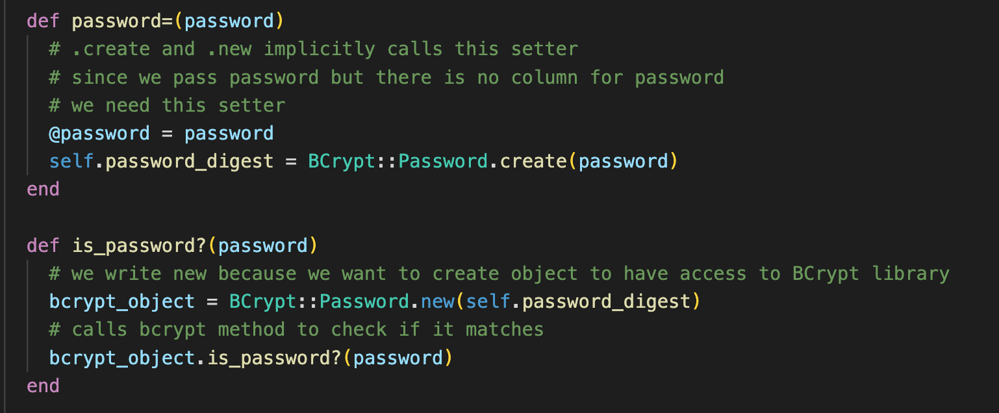
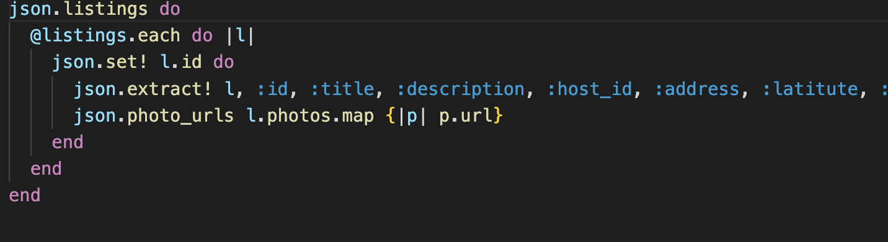
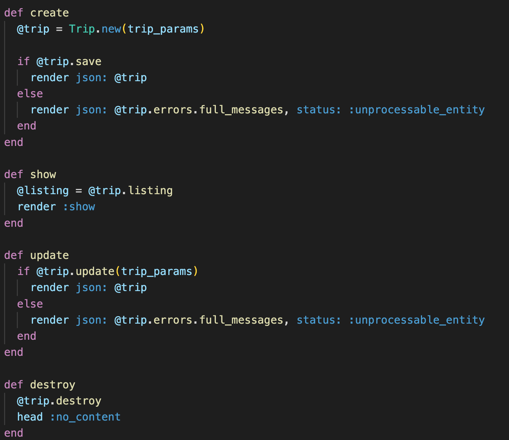

# AirBbB
[live website](https://airbbb-1zn2.onrender.com/)

## Background
This website is a Full Stack clone of AirBnB, you can click on a post and read details of the listing. Then you can create/update/remove a listing, book/update/remove a trip, and write/update/remove a review.

## Technology
- **React** - An frontend library for building user interfaces. It is maintained by Facebook and a community of individual developers and companies.
- **Redux** - A predictable, centralized state container for JavaScript apps.
- **Ruby on Rails** - Backend framework will boiler plate to develop MVC workflow.
- **BCrypt** - User auth package to generate password hash with salt.
- **Database** - PostgreSQL.
- **Other** AWS for image storage and uploads, Google Map API.

## Features
### User Authentication - Login/Signup
User can signup or login into their account. Backend uses BCrypt to authenticate users.

### Listing & Book Trip
User can check out a listing and see what

### Trips
User can book, change or delete trips.

### Review
User can write or delete reviews they wrote.

<!--  -->
